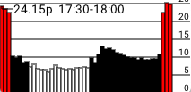
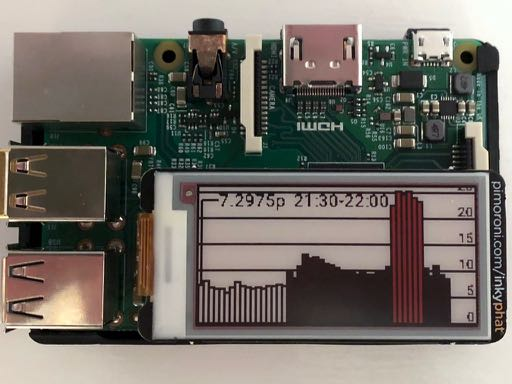

# Nerves Agile Octopus

Display [Agile Octopus](https://octopus.energy/agile/) electricity prices on an Inky pHAT display connected to a Raspberry Pi using [Nerves](https://nerves-project.org/).



The display shows the half-hourly Agile Octopus electricity prices to  help shift your energy use outside the 4-7pm tariff peak and identify cheap electricity periods to save money.

The three hour peak period incurs a 12p/kWh surcharge whereas overnight it can drop significantly. It can go down to almost zero when demand is low and weather conditions are favourable for renewables.

Not yet an Octopus Energy customer? You can [sign up using this referral link to get a £50 credit for you](https://share.octopus.energy/straw-ibex-344) (and me).

### How does it work?

Agile prices are fetched from the Octopus API each day at 6 PM. Prices for the next 12 hrs, in half hourly blocks, are shown. The left hand block is the current price which is also labelled with the time period. The display is updated every half an hour.

Each time block is coloured based upon its electricity cost:

- White (< 8p/kWh)
- Black (8-20p/kWh)
- Red (> 20p/kWh)

### Example

Running on an Inky pHAT red display connected to a Raspberry Pi 2 Model B.



## Prerequisites

- Install Elixir.
- [Install Nerves](https://hexdocs.pm/nerves/installation.html).
- Supported [nerves device](https://nerves-project.org/) (e.g. a Raspberry Pi) - _or you can just run it locally_.

### Configure wireless networking

The `config/target.exs` file used to configure the target device expects the following two environment variables to be set to configure the wireless settings used when building the firmware image:

```
export NERVES_NETWORK_SSID="<SSID>"
export NERVES_NETWORK_PSK="<PASSWORD>"
```

### Targets

Nerves applications produce images for hardware targets based on the `MIX_TARGET` environment variable. If `MIX_TARGET` is unset, `mix` builds an
image that runs on the host (e.g., your laptop). This is useful for executing logic tests, running utilities, and debugging. Other targets are represented by a short name like `rpi3` that maps to a Nerves system image for that platform. All of this logic is in the generated `mix.exs` and may be customized. For more information about targets see: https://hexdocs.pm/nerves/targets.html#content

## Getting Started

To start the Nerves app:
  * `export MIX_TARGET=my_target` or prefix every command with `MIX_TARGET=my_target`. For example, `MIX_TARGET=rpi3`
  * Install dependencies with `mix deps.get`
  * Create firmware with `mix firmware`
  * Burn to an SD card with `mix firmware.burn`

In a single command:

```
export MIX_TARGET=my_target
mix do deps.get, firmware, firmware.burn
```

Or:

```
MIX_TARGET=<target> mix do deps.get, firmware, firmware.burn
```

Now put the SD card into your device and turn it on.

### Deploying firmware to target device via SSH

Once the nerves device is running and connected to the network you can push new firmware updates using SSH. It's much quicker than burning to an SD card.

First, generate an `upload.sh` script:

```
export MIX_TARGET=rpi
mix firmware.gen.script
```

Then build a firmware image and upload it to the target device via SSH:

```
export MIX_TARGET=rpi
mix deps.get
mix firmware
./upload.sh
```

### Running on local host

A simulation of the Inky pHAT display can be run locally for convenience of development and testing.

First, fetch the Agile Octopus standard unit rates for your tariff and store the JSON data to a local file so that it can be read from disk, instead of being fetched from the Octopus API each time.

```
curl "https://api.octopus.energy/v1/products/AGILE-18-02-21/electricity-tariffs/E-1R-AGILE-18-02-21-H/standard-unit-rates/" > priv/agile_octopus_unit_rates.json
```

Then run `iex -S mix run` OR `mix run --no-halt`
